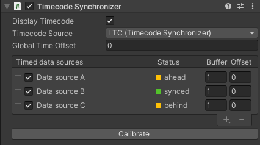

# Timecode Synchronizer component

Use this component in any GameObject of your current Scene to enable timecode synchronization between compatible Live Capture devices connected to the Unity Editor.

To get a functional Timecode Synchronizer, you must use this component along with another component according to the timecode source you need to use: [LTC Timecode Source](ref-component-ltc-timecode-source.md), [NTP Timecode Source](ref-component-ntp-timecode-source.md), or [System Clock Timecode Source](ref-component-system-clock-timecode-source.md).

## General properties

| Property | Function |
|:---|:---|
| **Display Timecode** | Displays the current timecode in the Game view.  **Note:** This timecode display is burnt into the Game view. If you want to export the Game view, you might first need to disable this option. |
| **Timecode Source** | The timecode source to use as the reference for synchronizing all your connected data sources.  The selection list includes all timecode source components present in any GameObject of the current Scene. The mention in parentheses indicates the name of the GameObject that holds the component. |
| **Global Time Offset** | The offset (in frames) to apply to the global timecode used for synchronization updates. Use a negative value to add a delay and compensate for high-latency sources. |

## Timed data sources

| Property | Function |
|:---|:---|
| **Device Name** | The name of the connected data source. |
| **Status** | The current timecode synchronization status of the data source. • **synced** (green): The source data is synchronized • **ahead** (yellow): The source data is ahead of the global time • **behind** (yellow): The source data is behind the global time • **no data** (gray): The source data is missing • **no source** (red): The source data is not available |
| **Buffer** | The input sample timecode buffer size (in frames) applied to the data source.   Adjust the value to minimally overlap with buffers of the other data sources. |
| **Offset** | The offset (in frames) to apply to the data source local timecode to fine-tune latency compensation. |

### List management

| Control | Function |
|:---|:---|
| Handle | Use the handles at the left to manually reorder the list. |
| Checkbox | Enable or disable the synchronization of the corresponding listed data source. |
| **+** (plus) | Add a data source to synchronize among the compatible Live Capture devices currently connected to the Unity Editor. |
| **-** (minus) | Remove the selected data source from the list. |

## Calibrate

Use the Calibrate button to automatically adjust the Global Time Offset and all timed data source Buffer values to get all data sources synchronized.
